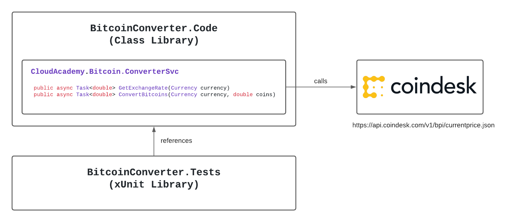

# TDD-Bitcoin-Converter-App


[](https://github.com/Dagim12/TDD-Bitcoin-Converter-App/actions/workflows/main.yml) [](https://coveralls.io/github/Dagim12/TDD-Bitcoin-Converter-App?branch=main)

## This is C# project excercise to cover Test Driven Development
The project implements a .Net Core 3.1 C# library which interacts with the [Bitcoin Price Index](https://www.coindesk.com/coindesk-api) api.





## Tools and Frameworks
The following tools and frameworks have been used to perform the TDD developement:
* [xUnit](https://xunit.net/) - a unit testing framework, used to implement unit tests
* [Moq](https://github.com/Moq/moq4/wiki/Quickstart) - a mocking library, used to create mocks for external dependencies
* [GitHub Actions](https://github.com/features/actions) - used to provide CICD features for automated building and testing
* [Coveralls](https://coveralls.io/) - used to provide unit test code coverage reports


## Bitcoin Converter Library
This project builds a .Net Core 3.1 library which contains the following 2 public methods:
```csharp
public async Task<double> GetExchangeRate(Currency currency)
```
returns in realtime the current Bitcoin exchange rate for the given currency (USD, GBP, or EUR)

```csharp
public async Task<double> ConvertBitcoins(Currency currency, double coins)
```
returns the dollar value for the given currency (USD, GBP, or EUR), and the number of Bitcoins

To build the Bitcoin Converter Library perform the following commands:

```
dotnet build
```

## Bitcoin Converter Client
This project also contains a sample [client](https://github.com/Dagim12/TDD-Bitcoin-Converter-App/tree/main/BitcoinConverter.Client) console based application - which imports the Bitcoin Converter library. To build and run the client for windows and Linux x64 distros, perform the following commands:

```bash
#build/package executable file
#Build for linux
cd BitcoinConverter.Client
dotnet publish --runtime linux-x64 --configuration Release /p:TargetFramework=netcoreapp3.1 /p:PublishSingleFile=true /p:PublishTrimmed=true

#Build for windows
cd BitcoinConverter.Client
 dotnet publish -r win10-x64 --configuration Release /p:TargetFramework=netcoreapp3.1 /p:PublishSingleFile=true /p:PublishTrimmed=true -o ./executable

#run executable:
./BitcoinConverter.Client
```

## GitHub Action - CICD
This project demonstrates how to use [GitHub Actions](https://github.com/cloudacademy/csharp-tdd-bitcoinconverter/blob/main/.github/workflows/dotnet-core.yml) to perform automated builds, testing, packaging, and releases.
